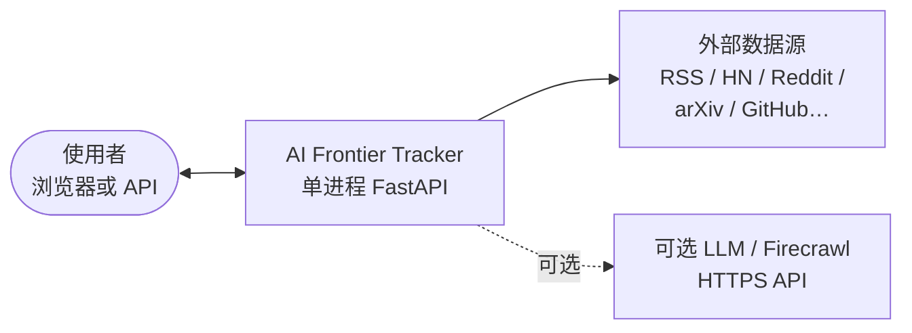
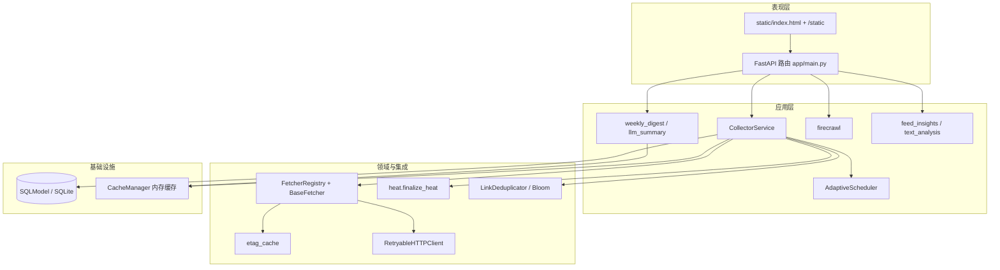

# AI Frontier Tracker — 架构方案

本文描述系统的整体设计、数据流、模块边界与扩展方式，供维护者与贡献者对齐上下文。运行与部署指令见根目录 [README.md](../README.md)；面向自动化代理的简要约定见 [AGENTS.md](../AGENTS.md)。

## 目录

1. [目标与范围](#1-目标与范围)
2. [系统上下文](#2-系统上下文)
3. [逻辑分层](#3-逻辑分层)
4. [核心数据流](#4-核心数据流一次完整采集)
5. [模块职责](#5-模块职责)
6. [数据模型摘要](#6-数据模型摘要)
7. [去重与热度](#7-去重与热度)
8. [API 分层](#8-api-分层概念)
9. [配置与扩展点](#9-配置与扩展点)
10. [部署与运行时](#10-部署与运行时)
11. [风险与权衡](#11-风险与权衡)
12. [相关文档索引](#12-相关文档索引)

---

## 1. 目标与范围

### 1.1 产品目标

从**使用者视角**，系统服务于：汇总**最前沿的 AI 大模型相关研究与实践成果**，支持你**挖掘未来有潜力的 AI 项目与方向**（从论文、开源与社区信号里筛早期线索），并做**轻量分析**（当下在讨论什么、相对近期是否在升温），从而与**产业 & 工程一线最活跃的公开叙事**保持同步。

从**实现视角**，系统聚合**多条公开数据源**（大厂/云厂商技术博客与 RSS、Hacker News、Reddit、Lobsters、arXiv、GitHub 等），在单进程内完成：

- **抓取与合并**：异步并行、可配置超时与限流；
- **排序与展示**：基于渠道底分、互动信号、时效与主题匹配的综合 **heat** 分数（表达「当前受关注程度」的代理指标）；
- **分析与洞察**：Feed 级 `insights`、词频与趋势 API，回答「最近在强调哪些主题」；
- **持久化与缓存**：SQLite（可换库）+ 内存 Feed 缓存；
- **可选增强**：Firecrawl 拉正文、LLM 摘要/中文周刊（依赖外部 API Key）。

### 1.2 非目标（当前版本）

- 多租户与用户账号体系；
- 分布式抓取队列（Celery/Kafka 等）；
- 自动化全量迁移框架（SQLite 以 `create_all` + 少量 `ALTER` 补齐列为主）。

---

## 2. 系统上下文

系统对外是一个 **FastAPI 进程**：暴露 JSON API、托管静态前端、在启动与按需请求时触发采集流水线。



实现上为**单一 Python 进程**：对外统一 HTTP 服务，按需调用外部 HTTP 源与可选增强服务。

---

## 3. 逻辑分层



---

## 4. 核心数据流：一次完整采集

入口：`CollectorService.collect_all()`（由 `/api/feed`、`/api/feed/refresh` 及启动预热调用）。

```mermaid
sequenceDiagram
  participant API as API / Startup
  participant COL as CollectorService
  participant SCH as AdaptiveScheduler
  participant F as Fetchers
  participant HEAT as finalize_heat
  participant DED as 按 link 归并
  participant OPT as Firecrawl / LLM
  participant DB as Article / CollectionRun
  participant MEM as MemoryCache

  API->>COL: collect_all()
  COL->>COL: Bloom 从 DB 预热（近 7 天链接）
  COL->>SCH: run_with_scheduling(fetchers)
  SCH->>F: fetch_with_state() 并行/有序
  F-->>COL: FetchResult 列表
  COL->>HEAT: 每条 finalize_heat
  COL->>DED: 同 URL 保留更高 heat / 更新日期
  COL->>COL: 论文数量不足时从 DB 兜底论文
  COL->>OPT: 可选增强（有 Key 时）
  COL->>COL: 排序 + paper floor + 裁剪临时字段
  COL->>DB: save_or_update_article
  COL->>DB: CollectionRun 记录
  COL->>MEM: set_feed
  COL-->>API: items, errors
```

### 4.1 关键步骤说明

| 步骤     | 说明                                                                                                                                               |
| -------- | -------------------------------------------------------------------------------------------------------------------------------------------------- |
| 调度     | `AdaptiveScheduler` 按最近成功率、响应时间、429 等调整优先级与推荐延迟，通过 `run_with_scheduling` 驱动各 fetcher。                                |
| 状态     | `BaseFetcher.fetch_with_state` 读写 `FetcherState`（`last_cursor` 等），支持增量语义。                                                             |
| 热度     | `finalize_heat` 综合 venue（大厂 RSS 底分等）、渠道互动临时字段（如 HN points）、时效、工程主题关键词等；输出写入 `heat` 与可选 `heat_breakdown`。 |
| 去重     | 合并阶段按 **link** 建字典，保留 heat 更高者（同分比较日期）；Bloom 与合并去重的关系见第 7.2 节。                                                  |
| 论文底线 | `feed_min_papers` / `feed_max_items` 控制列表长度与最少论文条数；活源不足时从 `Article` 表拉近期论文补齐。                                         |
| 可选增强 | Firecrawl：描述过短或高热条目的正文/标签增强（并发受限）；LLM：对论文/高热/短描述条目生成中文摘要（并发与条数受限）。                              |
| 持久化   | `DatabaseCache.save_or_update_article` 以 `link_hash` 唯一；`CollectionRun` 记录一轮耗时与错误摘要。                                               |
| 读缓存   | `CacheManager` 将整份 Feed 放在内存 TTL 缓存（默认与 `CONFIG.cache` 对齐），减少重复抓取。                                                         |

---

## 5. 模块职责

| 路径                                              | 职责                                                                                                                         |
| ------------------------------------------------- | ---------------------------------------------------------------------------------------------------------------------------- |
| `app/main.py`                                     | 应用入口、路由、CORS、静态资源挂载、`load_dotenv`、启动预热。                                                                |
| `app/config.py`                                   | 全局与各 fetcher 的 `FetcherConfig`；`schema_version` API/前端契约版本。                                                     |
| `app/database.py`                                 | Engine、`init_db`、SQLite 上 `fetcher_states` 缺列时的轻量迁移。                                                             |
| `app/models.py`                                   | `FeedItem` API 模型；`Article`、`FetcherState`、`FetcherHealth`、`CollectionRun` 表模型。                                    |
| `app/fetchers/`                                   | `BaseFetcher`、`FetchResult`、`@register_fetcher`；各渠道实现；`FetcherRegistry` 列举实例并按 `CONFIG.<name>.enabled` 过滤。 |
| `app/services/collector.py`                       | **编排中心**：调度、合并、热度、增强、持久化、运行统计。                                                                     |
| `app/services/scheduler.py`                       | 自适应调度指标与 `run_with_scheduling`。                                                                                     |
| `app/services/cache.py`                           | `MemoryCache`、`DatabaseCache`、`CacheManager`（Feed 内存缓存 + 文章 UPSERT）。                                              |
| `app/services/http_client.py`                     | 可重试 HTTP 客户端（含 304 等）供 fetcher 使用。                                                                             |
| `app/services/llm_summary.py`                     | 多厂商 LLM 摘要调用。                                                                                                        |
| `app/services/weekly_digest.py`                   | 中文周评（有 Key 走模型；无 Key 走统计兜底文案）。                                                                           |
| `app/services/firecrawl.py`                       | Firecrawl API 封装。                                                                                                         |
| `app/utils/heat.py`                               | 热度计算与渠道规则。                                                                                                         |
| `app/utils/bloom.py`                              | Bloom / `LinkDeduplicator`（见 7.2）。                                                                                       |
| `app/utils/etag_cache.py`                         | 条件请求与 ETag 磁盘缓存。                                                                                                   |
| `app/utils/text_analysis.py` / `feed_insights.py` | 词频、趋势与 Feed 洞察（供 API 与前端）。                                                                                    |
| `static/`                                         | 前端静态资源。                                                                                                               |

---

## 6. 数据模型摘要

### 6.1 `Article`

- 唯一键：`link_hash`（URL 的 MD5）。
- 业务字段：`type`（`paper` / `news` / `repo`）、`title`、`desc`、`tags`（JSON 字符串）、`date`、`venue`、`heat`。
- 元数据：`created_at`、`updated_at`、`fetch_count`、`last_fetched_at`；`raw_data` 可存 `heat_breakdown` 等 JSON。

### 6.2 `FetcherState`

按 `fetcher_name` 记录增量抓取状态：`last_cursor`、`last_success_at`、错误计数等。

### 6.3 `CollectionRun`

每轮采集的完成时间、总条数、`duration_ms`、`errors`（JSON 数组字符串）。

### 6.4 API 载荷

对外列表项为类 `FeedItem` 结构（`tags` 为列表）；与库内 `Article.tags` 字符串存储需在边界处序列化/反序列化（collector / cache 已处理）。

---

## 7. 去重与热度

### 7.1 合并去重（事实路径）

采集完成后，所有条目进入 `_deduplicate`：**同一 `link` 只保留一条**，比较 `heat` 与 `date`，与 Bloom 判定无关。这保证了 Feed 列表无重复 URL。

### 7.2 Bloom Filter（`app/utils/bloom.py`）

- **当前行为**：采集开始前从数据库加载近 7 天 `Article.link` 批量加入 `LinkDeduplicator`，并在 `/api/health/detailed` 中返回 Bloom 统计。
- **`deduplicate_items`**：可在扩展抓取链路时用于「抓取后、入库前」的快速筛重；与 `_deduplicate` 可并存，职责不同。

若后续要在 **fetcher 内部** 提前丢弃高概率重复项，可在该层调用 `deduplicate_items`，需注意与最终 `_deduplicate` 的一致性。

---

## 8. API 分层（概念）

| 类别       | 路径示例                                                      | 说明                                                                      |
| ---------- | ------------------------------------------------------------- | ------------------------------------------------------------------------- |
| 健康       | `GET /api/health`、`GET /api/health/detailed`                 | 存活检查与抓取器/调度/Bloom 维度的详情。                                  |
| Feed       | `GET /api/feed`、`POST /api/feed/refresh`                     | 读缓存或触发 `collect_all`；返回 `insights`、`errors`、`schema_version`。 |
| 综述       | `GET /api/weekly-digest`                                      | 依赖当前内存 Feed；LLM 可选。                                             |
| 统计与分析 | `GET /api/stats`、`/api/analytics/*`                          | 读库聚合与词频/趋势。                                                     |
| 增强       | `POST /api/enhance`、`GET /api/scrape`、`POST /api/summarize` | Firecrawl / LLM，需 Key。                                                 |
| 前端       | `GET /`、`/static/*`                                          | 静态页与资源。                                                            |

完整列表以 OpenAPI `/docs` 为准。

---

## 9. 配置与扩展点

### 9.1 新增数据源

1. 在 `app/fetchers/` 实现类继承 `BaseFetcher`，实现 `async def fetch(self, cursor=None) -> FetchResult`。
2. 使用 `@register_fetcher("name")` 注册；在 `app/fetchers/__init__.py` 中 import 以执行注册副作用。
3. 在 `app/config.py` 的 `AppConfig` 上增加 `name: FetcherConfig = field(default_factory=FetcherConfig)`，与 `FetcherRegistry.get_all` 中 `getattr(CONFIG, name)` 对齐。
4. 若需全新状态字段，扩展 `FetcherState` 并评估 SQLite `ALTER` 迁移（参考 `database._migrate_sqlite_fetcher_states`）。

### 9.2 契约版本

修改 Feed JSON 形状或字段语义时，递增 `CONFIG.schema_version`，并协调前端 `static/` 消费方。

### 9.3 环境变量

见 [.env.example](../.env.example)。容器场景见 [Dockerfile](../Dockerfile) 与 [docker-compose.yml](../docker-compose.yml)。

---

## 10. 部署与运行时

- **进程模型**：单 Uvicorn 进程，异步抓取在同一事件循环中由 `asyncio` 协作式调度。
- **数据库路径**：默认相对工作目录 `./data`；Docker 镜像内通过 `DATABASE_URL=sqlite:////app/data/...` 与卷挂载对齐。
- **启动行为**：`startup` 尝试执行一轮 `collect_all` 预热缓存，失败则静默跳过，不阻塞服务启动。

---

## 11. 风险与权衡

| 主题         | 说明                                                                                                  |
| ------------ | ----------------------------------------------------------------------------------------------------- |
| 外部源可用性 | 任一源失败记录于 `errors` 数组，不阻断整轮（单 fetcher 异常由调度与 `FetchResult` 消化）。            |
| 速率限制     | arXiv 等源在 `FetcherConfig` 中加宽超时与退避；调度器根据 429 抬高推荐延迟。                          |
| SQLite 并发  | 默认 `check_same_thread=False` 适配 SQLAlchemy；高并发写入场景可换 PostgreSQL 等并改 `DATABASE_URL`。 |
| API Key 成本 | Firecrawl/LLM 在 collector 内限制条数与并发，避免单次刷新耗尽配额。                                   |

---

## 12. 相关文档索引

| 文档                                  | 用途                                   |
| ------------------------------------- | -------------------------------------- |
| [README.md](../README.md)             | 安装、运行、Docker、环境变量、API 速览 |
| [CONTRIBUTING.md](../CONTRIBUTING.md) | 开源贡献流程与 checklist               |
| [SECURITY.md](../SECURITY.md)         | 漏洞私下报告方式                       |
| [AGENTS.md](../AGENTS.md)             | 代理协作约定与目录鸟瞰                 |
| 本文                                  | 架构与数据流、扩展点、权衡             |

---

_文档版本与代码库 `schema_version` 无强制绑定；重大架构变更时请更新本节日期与对应章节。_

_最后更新：2026-04-01_
